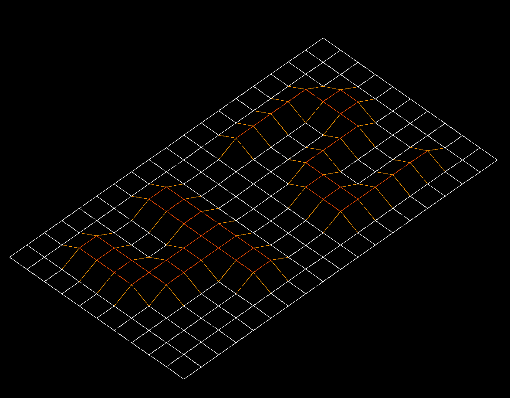
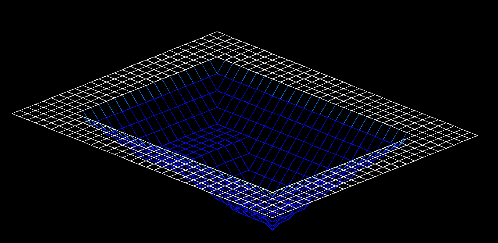

# fil-de-fer

Graphical representation of a map elevations using an isometric map viewer, rendering 3D views.

## Implemented features  
+ Input file and parsing error detections
+ Zoom: using '+' and '-' keys
+ Relief control: depth and heigh using '{' and '}'
+ Map control: Moving up, down, left, right using arrow keys
+ Rotation: using 'shift' and 'caps lock' keys
+ Scale control
+ Auto-centering
+ Color shades

## Details  

Project coded in *C* using the *mlx* graphical library and my personal standard C library.  

## Data structures

Single linked list

## Preview  

### 42  

### Pyramid

